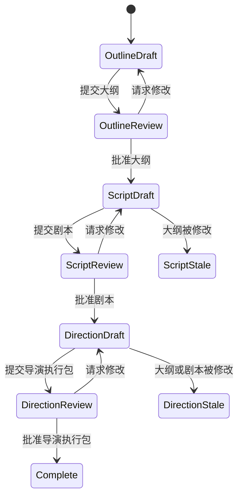
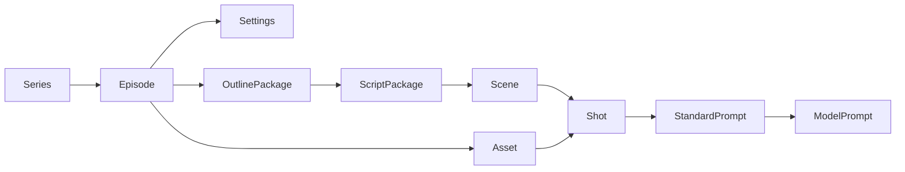

# 第一阶段架构

## 核心原则

制作流程是一个深模块。页面、Agent 和未来的 HTTP 接口只需要学习四个操作：

- 提交阶段产物；
- 批准阶段产物；
- 请求修改；
- 读取当前快照。

阶段顺序、审批前置条件、资产确认、分镜时长和下游失效都封装在模块内部。

## 工作流

## 阶段参与角色

| 阶段 | 参与 Agent |
|---|---|
| 大纲 | 总导演、策划、编剧、连续性审校 |
| 剧本 | 总导演、编剧、美术指导、连续性审校 |
| 分镜与提示词 | 总导演、分镜导演、美术指导、提示词工程师、配音指导、音乐指导、连续性审校 |

每个阶段最多进行两轮“提案—质疑—修订”。重大分歧才升级给用户。

## 数据关系

## 首批不变量

1. 剧本只能在大纲批准后提交。
2. 导演执行包只能在剧本批准后提交。
3. 未确认资产不能被镜头引用。
4. 默认不限制单镜头时长。
5. 配置时长上限后，任何超时镜头都会阻止提交。
6. 修改上游产物会将下游产物标记为失效。
7. 每次批准都保留对应版本的不可变审批快照。
